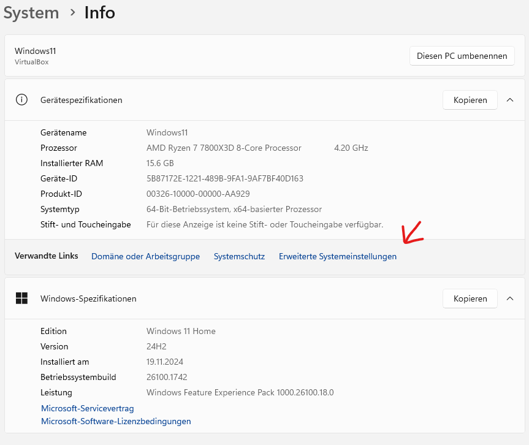
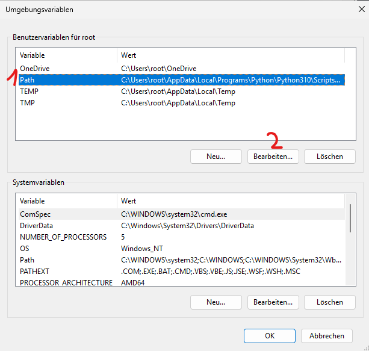
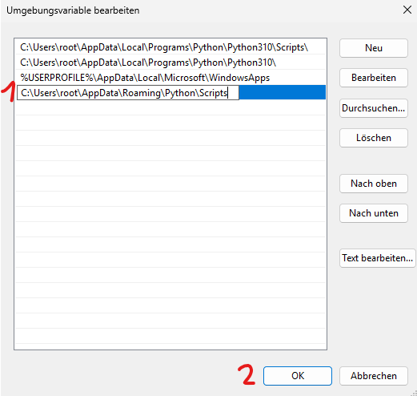

# Adding Programs to Windows PATH - A Simple Guide

This guide will help you add programs to your Windows PATH environment variable. We'll use Poetry (a Python package
manager) as an example, but these steps work for any program you want to access from the command line.

## What is PATH?

PATH is like a list of folders that Windows checks when you type a command. When you add a folder to PATH, Windows can
find and run programs in that folder from anywhere on your computer.

## Step-by-Step Instructions

### 1. Copy the Program's Location

- In this example, we'll use Poetry's location: `C:\Users\<UserName>\AppData\Roaming\Python\Scripts`
- Replace `<UserName>` with your actual Windows username
- Tip: You can copy the location from File Explorer's address bar

### 2. Open System Properties

1. Right-click on the Windows Start button (or press Win + X)
2. Click "System"
3. Scroll down and click "Advanced system settings" on the right

   

### 3. Access Environment Variables

1. In the System Properties window, click "Environment Variables" at the bottom
2. Look for "Path" under "User variables for <your username>"
3. Select "Path" and click "Edit"

   

### 4. Add the New Path

1. Click "New" in the edit window
2. Paste the location you copied earlier (e.g., `C:\Users\<UserName>\AppData\Roaming\Python\Scripts`)
3. Click "OK" on all windows to save changes

   

### 5. Verify the Installation

1. Open a new Command Prompt or PowerShell window (the change won't work in already-open windows)
2. Type the program name (e.g., `poetry --version`)
3. If successful, you'll see the program respond instead of "command not found"

## Troubleshooting

- If the program isn't recognized, double-check that:
    1. You used the correct path
    2. You opened a new command window
    3. The program files actually exist in that location
- Still not working? Try logging out and back in, or restart your computer

## Tips

- Keep the original path handy in case you need to remove it later
- Always use a new command window to test changes
- Be careful not to modify or delete existing PATH entries
