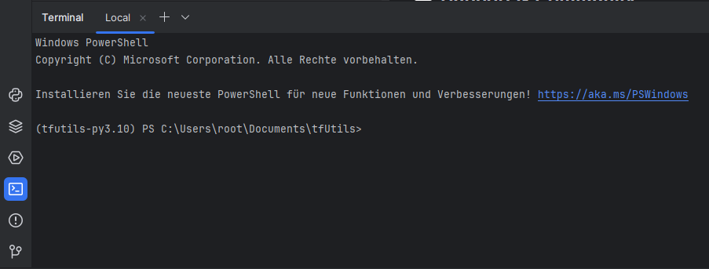

# Getting Started with Development

This guide will walk you through setting up your development environment for contributing to TF Utils. Whether you're
looking to fix bugs, add new features, or improve documentation, this guide will help you get started.

## Prerequisites

Before you begin, ensure you have the following tools installed on your system:

### Required Tools

- **Python**: Version 3.10
    - Download from [python.org](https://www.python.org/downloads/release/python-31011/){:target="_blank"}
    - IMPORTANT: Make sure to download Python 3.10.x, and not any other version
    - On the download page, scroll down to "Files" and download the installer for your system
    - Default installation options are fine, don't click "Custom Installation"
    - Make sure to check "Add Python to PATH" during installation
    - And "Disable path length limit" if you're on Windows on the last screen
    - Verify installation: `python --version`
    - [How to run commands in the terminal](run-commands.md)
- **Git**: Latest stable version
    - Download from [git-scm.com](https://git-scm.com/downloads){:target="_blank"}
    - Default installation options are fine (just keep clicking "Next")
    - Unclick "View Release Notes" at the end (optional)
    - Verify installation: `git --version`
- **Poetry**: Dependency manager
    - Download from
      [python-poetry.org](https://python-poetry.org/docs/#installing-with-the-official-installer){:target="_blank"}
      (advanced)
    - Or via PowerShell (recommended):
        ```powershell
        (Invoke-WebRequest -Uri https://install.python-poetry.org -UseBasicParsing).Content | py -
        ```
    - Get the Poetry path from the command output and add Poetry to your PATH variables (something
      like `C:\Users\<UserName>\AppData\Roaming\Python\Scripts`).
    - [Learn how to add something to your path here](add-to-path){:target="_blank"}
    - Verify installation: `poetry --version`

### Recommended Tools

- **PyCharm Community Edition**: IDE for Python development
    - Download from [jetbrains.com/pycharm/download](https://www.jetbrains.com/pycharm/download){:target="_blank"}
    - Scroll down to "Community" and click "Download"
    - Default installation options are fine
    - Recommended for easier development but any text editor will work

### Optional Tools

- **Inno Setup**: Only needed if you plan to build installers
    - Download from [jrsoftware.org/isinfo.php](https://jrsoftware.org/isinfo.php){:target="_blank"}
    - Required for creating Windows installers

## Setting Up Your Development Environment

Follow these steps to set up your local development environment:

### 1. Fork the Repository

1. Visit the [TF Utils Repository](https://github.com/ImGajeed76/tfUtils){:target="_blank"}
2. Click the "Fork" button in the top-right corner
3. Wait for GitHub to create your copy of the repository

### 2. Clone Your Fork

1. Go to the folder where you want to store the project. (e.g., `C:\Users\<UserName>\Documents`)
2. Open a terminal window (Command Prompt, PowerShell, or Git Bash) in that folder
    - Tip: Type `cmd` in the address bar of File Explorer and press Enter
3. Clone your forked repository:

```bash
# Clone your forked repository
git clone https://github.com/[your-username]/tfUtils.git

# Navigate to the project directory
cd tfUtils
```

### 4. Configure Poetry

Set up Poetry for optimal usage with the project:

```bash
# Configure Poetry to create virtual environments in the project directory
poetry config virtualenvs.in-project true

# Install project dependencies
poetry install
```

### 5. Install Pre-commit Hooks

We use pre-commit hooks to ensure code quality. Install them with:

```bash
# Install pre-commit hooks
poetry run pre-commit install

# Run hooks against all files to verify installation
poetry run pre-commit run --all-files
```

## Development Tools

TF Utils uses several tools to maintain code quality:

- **Black**: Code formatter
    - Enforces consistent code style

- **isort**: Import sorter
    - Organizes import statements

- **Ruff**: Linter
    - Checks for common issues

- **pre-commit**: Git hooks
    - Runs all checks before commits
    - Automatically formats code
    - Prevents committing invalid code

## Verifying Your Setup

To ensure everything is set up correctly:

1. Run the development version:

```bash
poetry run python main.py
```

2. Check code formatting:

```bash
poetry run pre-commit run --all-files
```

## Opening the Project in PyCharm

If you're using PyCharm, you can open the project directly:

1. Open PyCharm via the Start menu
2. If you start PyCharm for the first time, agree to the terms and conditions
3. Also, you can press "Don't send" when asked to send data to JetBrains
4. Click "Open" and navigate to the project folder (e.g., `C:\Users\<UserName>\Documents\tfUtils`)
5. Click "Trust Project" to enable all features
6. If PyCharm asks to install dependencies, click "Install"
7. PyCharm will set everything up for you. Relax and wait until the progress bar vanishes in the bottom right corner

### Quick Tour of PyCharm

On the left side, you see the project structure. Here you can navigate through the files and folders.

The main window is the editor. Here you can write and edit code. You can have multiple tabs open at once.
To close a tab, click the "x" on the right side of the tab or Middle-click the tab.
If you want you can also split the editor window by dragging a tab to the top, bottom, left, or right side of the editor
window.

On the bottom left, you see a terminal icon. Click it to open a terminal window inside PyCharm.



If you are prompted to run anything in the terminal, you can do so here.

Most of the time, you will be in the `src/interfaces` directory. This is where all interfaces are stored.

Perfect! You are now ready to start developing! Happy coding! 🎉

## Next Steps

Now that your development environment is set up, you can:

1. Create your first [Simple Interface](../tutorials/first-interface.md)
2. Create a weather app using APIs: [Weather App](../tutorials/weather-app.md)
3. Learn about our [Development Workflow](workflow.md)
4. Explore the [Project Structure](structure.md)
5. Read about [Creating Features](creating-features.md)

## Getting Help

If you encounter any issues during setup:

1. Search existing [GitHub Issues](https://github.com/ImGajeed76/tfUtils/issues)
2. Ask for help in [Discussions](https://github.com/ImGajeed76/tfUtils/discussions)
3. [Create a new issue](https://github.com/ImGajeed76/tfUtils/issues/new) if the problem persists
